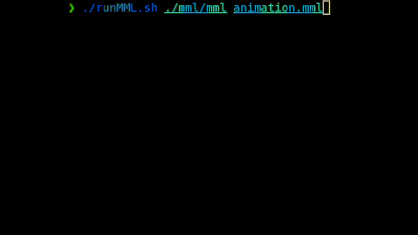

# MML compiler

At the beginning of development, the repository contains source code for the Simple language in which all references to MML have been replaced by MML.

The steps to develop a full MML compiler imply the adaptation of:
* the scanner (`mml_scanner.l`)
* the parser (`mml_parser.y`)
* the symbol (`targets/symbol.h`)
* the type checker (`targets/type_checker.cpp`)
* the XML writer (for the middle delivery: `targets/xml_writer.cpp`)
* the Postfix writer (for the final delivery: `targets/postfix_writer.cpp`)

Note that not all the code has to be working for all deliveries. Check the evaluation conditions on the course pages.

## Run Sample

To run the sample, execute the following commands:

```bash
nix develop # if not on nix, you'll need to set up the environment yourself
make
./runMML.sh ./mml sample/animation.mml
```


